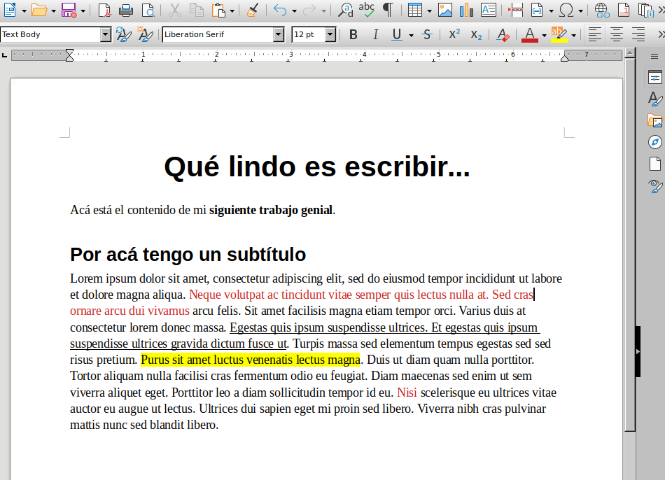
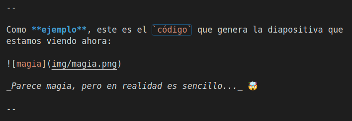
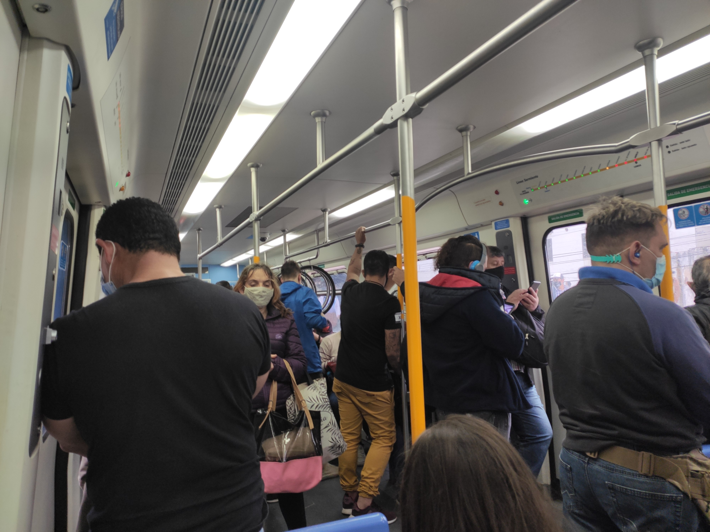
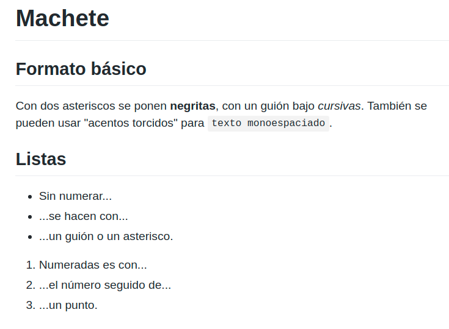
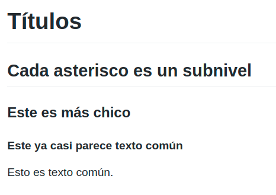
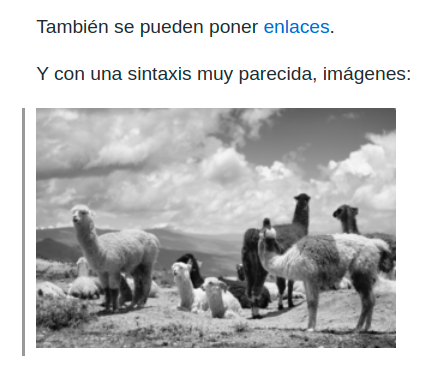
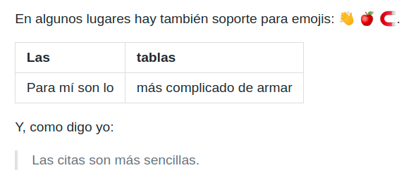
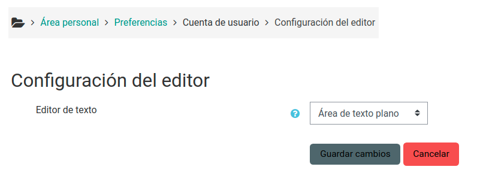

# Markdown

Cómo armar **documentos** y **presentaciones** sin _editores complicados_.

 &nbsp; &nbsp; 

===

<div style='position: relative; padding-bottom: 56.25%; padding-top: 35px; height: 0; overflow: hidden;'><iframe sandbox='allow-scripts allow-same-origin allow-presentation' allowfullscreen='true' allowtransparency='true' frameborder='0' height='315' src='https://www.mentimeter.com/embed/0f606b6c507ca13d80b601b713cabd77/c47521e6ea2b' style='position: absolute; top: 0; left: 0; width: 100%; height: 100%;' width='420'></iframe></div>

<small>☝️ No cierren la página, que hay dos preguntas.</small>

===

## ¡Gracias a la comunidad Clementina!


Si tienen Telegram y les interesa profundizar en software libre aplicado a la educación, no duden en unirse:
https://t.me/Clementina_SHCL

===

## WYSIWYG

Probablemente nuestro primer acercamiento a la computadora... <!-- .element: class="fragment" -->

🇺🇲 _What you see is what you get_

<!-- .element: class="fragment" -->

🇦🇷 _Lo que ves es lo que obtienes_

<!-- .element: class="fragment" -->

Con **algo de suerte**, lo que vemos es lo que obtendremos cuando haya que publicarlo.

<!-- .element: class="fragment" -->

--

Básicamente, **contenido** y **formato** son una misma cosa.



--

Seguramente muchas, sino todas, las herramientas que utilizan a diario funcionan con este paradigma:

- Microsoft Word,
- Microsoft PowerPoint,
- Google Docs,
- LibreOffice Writer.

Aunque se pueden hacer algunas cosas con el teclado, suelen estar diseñadas dándole prioridad al uso del _mouse_. 🖱️

--

| Ventajas                                | Desventajas                                                 |
| --------------------------------------- | ----------------------------------------------------------- |
| Baja curva de aprendizaje.              | Cuesta bastante lograr consistencia.                        |
| Ampliamente difundidas.                 | Incompatibilidades entre distintas versiones.               |
| Se pueden lograr diseños muy complejos. | Hacer modificaciones puede fácilmente "descompaginar" todo. |

===

## Texto plano

Cuenta la leyenda que allá lejos y hace tiempo, el _mouse_ no existía y las computadoras se manejaban **únicamente con el teclado**. 😲 ⌨️

Lógicamente, las interfaces de usuarix **se basaban en texto**, y "la máquina" estaba mucho más presente en lo que hacíamos.

--

A quienes programamos (aunque eso también se va desdibujando), nos es habitual la idea de que editamos **código fuente** y que luego eso _se transforma_ en algún tipo de **resultado** que la computadora puede interpretar.

```plantuml
!$BGCOLOR = "transparent"
!theme plain

hide empty members

skinparam state {
  StartColor MediumBlue
  EndColor Red
}

[*] -right-> Compilación
Compilación -right-> [*]
```

A ese proceso de transformación lo llamamos **compilación**.

--

Ese código fuente, lógicamente, debe estar escrito en algún lenguaje con reglas rígidas para poder ser transformado por un programa.

Y acá entra **Markdown**: un lenguaje _de marcado_, que sirve para escribir documentos y varias cosas más.

--

Como **ejemplo**, este es el `código` que genera la diapositiva que estamos viendo ahora:



_Parece magia, pero en realidad es sencillo..._ 🤯

--

Una gran virtud del texto plano es que se puede escribir en **cualquier dispositivo**, prácticamente desde **cualquier aplicación** y transmitir por cualquier medio.

Un archivo `.txt` es texto plano, un mail sin formato también, un mensajito de WhatsApp o Telegram también (emojis incluidos).

--

Como ejemplo, este era el paisaje que veía cuando empecé a armar estas diapositivas.



--

| Ventajas                                           | Desventajas                                                          |
| -------------------------------------------------- | -------------------------------------------------------------------- |
| El estilo será siempre consistente.                | Hay que aprenderse la sintaxis.                                      |
| Hay miles de herramientas distintas para editarlo. | Puede ser complejo encontrar otras personas que quieran incursionar. |
| La simplicidad es una decisión de diseño.          | Para lograr diseños más complejos hay que acudir a extensiones.      |

===

## Sintaxis

```markdown
# Machete

## Formato básico

Con dos asteriscos se ponen **negritas**, con un guión bajo _cursivas_.
También se pueden usar "acentos torcidos" para `texto monoespaciado`.

## Listas

- Sin numerar...
- ...se hacen con...
- ...un guión o un asterisco.

1. Numeradas es con...
2. ...el número seguido de...
3. ...un punto.
```

<!-- .element: class="fullscreen" -->

--



--

```markdown
# Títulos

## Cada asterisco es un subnivel

### Este es más chico

#### Este ya casi parece texto común

Esto es texto común.
```



--

```markdown
También se pueden poner [enlaces](https://unahur.edu.ar).

Y con una sintaxis muy parecida, imágenes:


```



--

```markdown
En algunos lugares hay también soporte para emojis:
:wave: :apple: :magnet:.

| Las            | tablas                  |
| -------------- | ----------------------- |
| Para mí son lo | más complicado de armar |

Y, como digo yo:

> Las citas son más sencillas.
```



--

Cada programa puede después hacer extensiones, por ejemplo:

````markdown
`$$ x = {-b \pm \sqrt{b^2-4ac} \over 2a} $$`

```plantuml
[*] -right-> Compilación
Compilación -right-> [*]
```

```js
function esPar(numero) {
  return numero % 2 === 0;
}
```
````

--

`$$ x = {-b \pm \sqrt{b^2-4ac} \over 2a}. $$`

```plantuml
[*] -right-> Compilación
Compilación -right-> [*]
```

```js
function esPar(numero) {
  return numero % 2 === 0;
}
```

===

## 🦾 Manos a la obra

> Armá un texto para publicar en Docutopia, el tema es libre.

Si tenés ganas, compartilo en el chat así lo vemos.

https://bit.ly/docutopiamd

===

<div class="titulo-logo">


## HedgeDoc

</div>

Editor colaborativo libre, con instancias públicas.

--

Algunas de las cosas que la herramienta permite:

- 🧑‍🏫 Armar **diapositivas**.
- 🖨️ **Exportar** a PDF.
- 👥 Escribir **colaborativamente** (tipo Google Docs).
- 📎 **Publicar** el resultado con un enlace: para una consigna, enunciado, etc.

--

Para este taller, estamos usando una instancia pública de un colectivo campesino colombiano llamado **Tupale**.

> La palabra Tupale significa hágale pues - hágalo con decisión.
> En esta metáfora, Tupale.co es una barca para navegar el proceso de adopción tecnológica, de adopción digital, para la producción de herramientas y productos digitales.

🗒️ Vale la pena [leer el manifiesto completo](https://docutopia.tupale.co/s/HJ_IZz1TQ).

===

<div class="titulo-logo">


## Zettlr

</div>

Editor libre, que funciona sin conexión a internet.

--

Algunas de las cosas que la herramienta permite:

- 🧑‍🏫 Armar **diapositivas**.
- 🖨️ **Exportar** a PDF, Word, OpenDoc y varios formatos más.
- 🔎 **Buscar y vincular** notas, basado en el sistema _Zettelkasten_.
- 🖋️ Administrar citas para **escritura académica**.

===

## Diapositivas

Esto sí es recontra dependiente de la herramienta, aunque de fondo todas las que indagué usan [reveal.js](https://revealjs.com/).

Lo que varía es el **separador** que se usa para diferenciar las diapositivas, y la forma de **establecer configuraciones**.

--

En Docutopia, la sintaxis es esta:

```markdown
# Un título

---

## Otra diapositiva

Con texto blabla.

---

Esta es otra más
```

===

## 🦾 Manos a la obra

> Armá una diapositiva como si quisieras convencer a un/a colega para que use Markdown.

Si tenés ganas, compartila en el chat así lo vemos.

https://bit.ly/diapomd

===

## Herramientas que soportan Markdown

Que tal vez ya usaste y no sabías.

--

### GitHub

Se puede usar en el _README_, en las _issues_, en la _wiki_ y prácticamente en cualquier lugar donde se permite poner texto.

--

### Moodle

Soporte nativo, puede utilizarse en los mismos lugares donde típicamente aparece el editor HTML.

 <!-- .element: style="width: 60%" -->

Hay posibilidad de agregar un editor más simpático con un plugin ([Marklar](https://moodle.org/plugins/editor_marklar)).

--

### Discord

Soporta todas las funcionalidades, excepto los enlaces.

--

### Otras herramientas

- **Cryptpad:** notas y diapositivas.
- **Nextcloud:** notas.
- **VSCode:** editor de texto para programación.
- **Markor:** notas para Android.

===

<div style='position: relative; padding-bottom: 56.25%; padding-top: 35px; height: 0; overflow: hidden;'><iframe sandbox='allow-scripts allow-same-origin allow-presentation' allowfullscreen='true' allowtransparency='true' frameborder='0' height='315' src='https://www.mentimeter.com/embed/35fcdaf1d13a309d44fb4307967704af/1449fc0a6a3b' style='position: absolute; top: 0; left: 0; width: 100%; height: 100%;' width='420'></iframe></div>

===

# ¿Preguntas?

<div class="red-social">
  <i class="fab fa-youtube color"></i>
  <span><a href="https://youtube.com/c/elsurtambienprograma">El Sur también programa</a></span>
</div>
<div class="red-social">
  <i class="fab fa-telegram-plane color"></i>
  <span><a href="https://t.me/surprograma">@surprograma<a></span>
</div>
<div class="red-social">
  <i class="fab fa-instagram color"></i>
  <span><a href="https://instagr.am/surprograma">@surprograma<a></span>
</div>

 &nbsp; &nbsp; 
