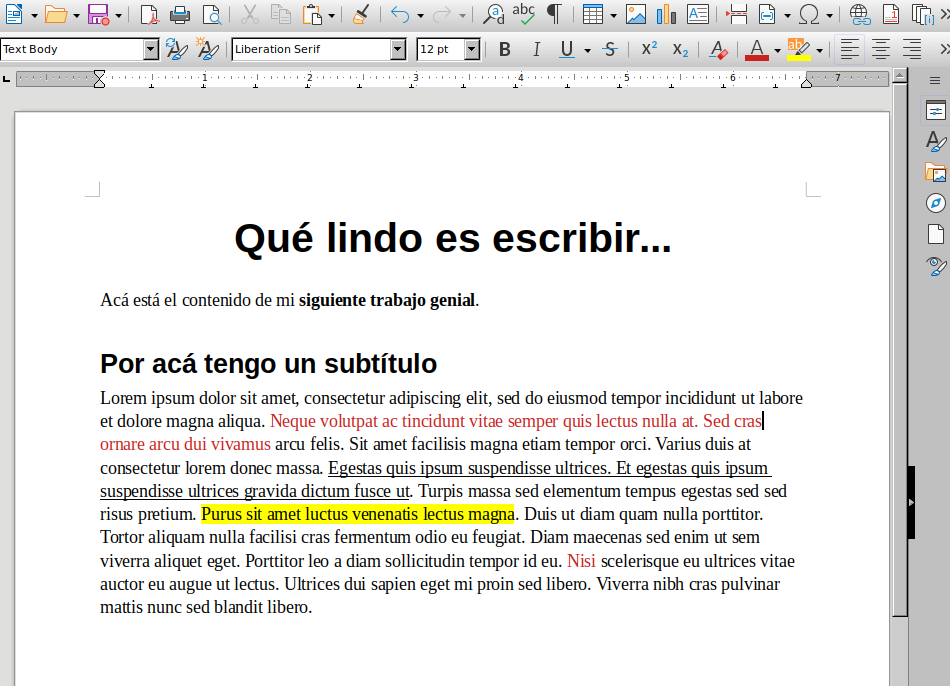
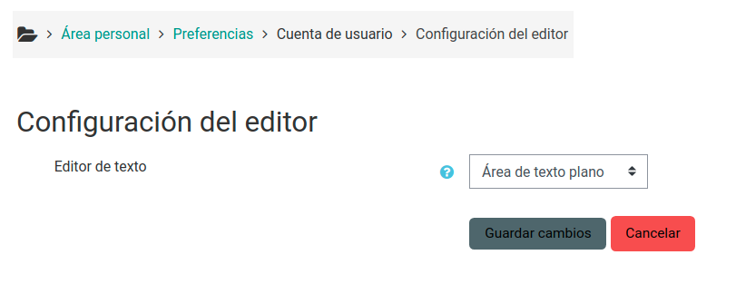

# Markdown

Cómo armar **documentos** y **presentaciones** sin _editores complicados_

 &nbsp; &nbsp; 

===

<!-- TODO: alguna encuesta inicial con Menti -->

===

## WYSIWYG

Probablemente nuestro primer acercamiento a la computadora... <!-- .element: class="fragment" -->

🇺🇲 _What you see is what you get_

<!-- .element: class="fragment" -->

🇦🇷 _Lo que ves es lo que obtienes_

<!-- .element: class="fragment" -->

Con **algo de suerte**, lo que vemos es lo que obtendremos cuando haya que publicarlo.

<!-- .element: class="fragment" -->

--

Básicamente, **contenido** y **formato** son una misma cosa.

--

Seguramente muchas, sino todas, las herramientas que utilizan a diario funcionan con este paradigma:

- Microsoft Word,
- Microsoft PowerPoint,
- Google Docs,
- LibreOffice Writer.

Aunque se pueden hacer algunas cosas con el teclado, suelen estar diseñadas dándole prioridad al uso del _mouse_. 🖱️

--

| Ventajas                                | Desventajas                                                 |
| --------------------------------------- | ----------------------------------------------------------- |
| Baja curva de aprendizaje.              | Cuesta bastante lograr consistencia.                        |
| Ampliamente difundidas.                 | Incompatibilidades entre distintas versiones.               |
| Se pueden lograr diseños muy complejos. | Hacer modificaciones puede fácilmente "descompaginar" todo. |

===

## Texto plano

<!-- TODO: contar que antes todo era así -->

Se puede usar en cualquier dispositivo y transmitir por cualquier medio. Un `.txt` es texto plano, un mensajito de WhatsApp también (emojis incluidos).

--

Como ejemplo, esto veía cuando empecé a armar estas diapositivas.

--

<!-- TODO: captura de fuente / generado -->

--

<!-- TODO: ventajas y desventajas -->

<!-- TODO: prioridad (o únicamente) teclado -->

===

## Sintaxis

<!-- TODO: machete -->

<!-- TODO: extendido con emojis -->

<!-- TODO: extendido con matemática, diagramas, etc -->

===

## HedgeDoc

Editor colaborativo libre, con instancias públicas.

--

Algunas de las cosas que la herramienta permite:

- 🧑‍🏫 Armar **diapositivas**.
- 🖨️ **Exportar** a PDF.
- 👥 Escribir **colaborativamente** (tipo Google Docs).
- 📎 **Publicar** el resultado con un enlace: para una consigna, enunciado, etc.

--

Para este taller, estamos usando una instancia pública de un colectivo campesino colombiano llamado **Tupale**.

> La palabra Tupale significa hágale pues - hágalo con decisión.
> En esta metáfora, Tupale.co es una barca para navegar el proceso de adopción tecnológica, de adopción digital, para la producción de herramientas y productos digitales.

🗒️ Vale la pena [leer el manifiesto completo](https://docutopia.tupale.co/s/HJ_IZz1TQ).

===

## Zettlr

Editor libre, que funciona sin conexión a internet.

--

Algunas de las cosas que la herramienta permite:

- 🧑‍🏫 Armar **diapositivas**.
- 🖨️ **Exportar** a PDF, Word, OpenDoc y varios formatos más.
- 🔎 **Buscar y vincular** notas, basado en el sistema _Zettelkasten_.
- 🖋️ Administrar citas para **escritura académica**.

===

## 🦾 Manos a la obra

<!-- TODO: ejercicio 1 - armar un PDF o un texto para publicar... tema libre -->

===

## Diapositivas

<!-- TODO: contar cómo se hacen, con los ---, que se usa Reveal y cómo verlas -->

===

## 🦾 Manos a la obra

<!-- TODO: ejercicio 2 - armar diapositivas... ¿qué aprendiste de MD? -->

===

## Herramientas que soportan Markdown

Que tal vez ya usaste y no sabías.

--

### GitHub

Se puede usar en el _README_, en las _issues_, en la _wiki_ y prácticamente en cualquier lugar donde se permite poner texto.

--

### Moodle

Soporte nativo, puede utilizarse en los mismos lugares donde típicamente aparece el editor HTML.

 <!-- .element: style="width: 60%" -->

Hay posibilidad de agregar un editor más simpático con un plugin ([Marklar](https://moodle.org/plugins/editor_marklar)).

--

### Discord

Soporta todas las funcionalidades, excepto los enlaces.

--

### Otras herramientas

- **Cryptpad:** notas y diapositivas.
- **Nextcloud:** notas.
- **VSCode:** editor de texto para programación.
- **Markor:** notas para Android.

===

<!-- TODO: alguna encuesta final con Menti... qué aprendiste, para qué lo usarías, etc -->

===

# ¿Preguntas?

  <i class="fab fa-youtube color"></i>
  <a href="https://youtube.com/c/elsurtambienprograma">El Sur también programa</a>

  <i class="fab fa-telegram-plane color"></i>
  <a href="https://t.me/surprograma">@surprograma<a>

  <i class="fab fa-instagram color"></i>
  <a href="https://instagr.am/surprograma">@surprograma<a>

 &nbsp; &nbsp; 
